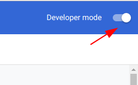
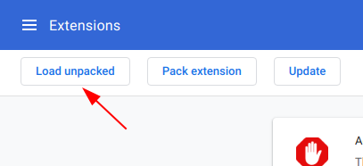

# Background

Are you envy with pro badge on your friend's github profile ?  
Bullied because you don't have pro badge ?  
Now everyone can have that **FOR FREE** !!! YEAAH ! :moneybag:

It would be nice if you star this repo. :star:

# How to

> User guide :  
> Suitable for ordinary people.

1. open extension page in chrome (you can type `chrome://extensions` on your browser)
2. Make sure you tick the developer mode  
   
3. Download the plugin [here](github-pro.crx)
4. Drag and drop the plugin to the extension page
5. Click 'ok' to install the plugin

> Developer guide :  
> Suitable for those who suspect me injecting malicious code in the plugin

1. Clone this repo
2. Read every file, find malicious code
3. If you can't spot it, open extension page (`chrome://extensions`)
4. Click load unpacked extension  
   
5. Click ok to continue to install the plugin

# Result

| Before                     | After                     |
| -------------------------- | ------------------------- |
|  |  |

# FAQ

Q: Why this plugin is not published in chrome store ? It may change the world !  
A: Dude, Don't you remember that I can't afford subscription fee for github pro plan ? Why do I have to invest my money and time for chrome developer account and maintaining this shit plugins.

Q: Will I get exclusive github pro features ?  
A: Despite it put badge on your github profile, it doesn't mean that you will receive the benefit of Github pro. It only does as it says, put pro badge on your github profile

Q: If I install this plugin, will I get 'pro' label in [@sonnylazuardi](https://github.com/sonnylazuardi) "github pro checker" ?  
A: No, Absolutely no. Please work harder, ask your lead to promote you so you get more money and able to subscribe to github pro membership.

### Disclaimer

This chrome plugin is only built for educational purpose.

### License

MIT
